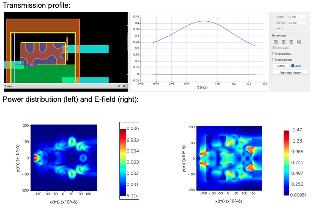
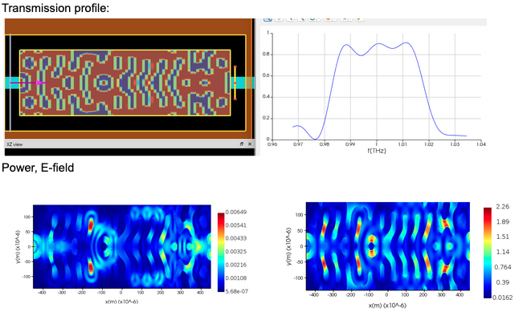
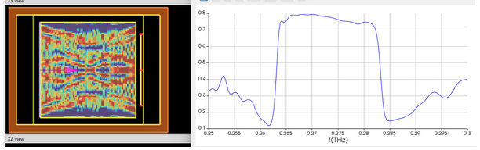

# Inverse Design of Terahertz Components

### Introduction
This is a collection of inverse-design programs I ran during my internship at the [Nonlinear Photonics Group](https://www.nonlinearphotonics.com/) at INRS-EMT in the Summer of 2024. 

The goal of inverse design in photonics is for a user to define the frequency response of a physical device and for a computer to intelligently explore the geometry space to find an optimal design. 

Lumerical comes with [Lumopt](https://developer.ansys.com/docs/lumerical/python-lumopt); a gradient calculator optimized for computing the [Adjoint](https://optics.ansys.com/hc/en-us/articles/360049853854-Photonic-Inverse-Design-Overview-Python-API) from the electric field. With Lumopt, we can parametrize the permittivity of a region in space, calculate the gradients of the objective function with respect to those parameters, and plug those into an optimizer such as L-BFGS-B to complete our design loop.  

Here's a few solutions included in this repo:

### 2D THz 50:50 Splitter

### 2D THz Bandpass Filter

### 0.3THz Surface-Engineered Bandpass Filter
Mapped a relative refractive index to the permittivity to simulate surface engineering of a parallel-plate waveguide.  

